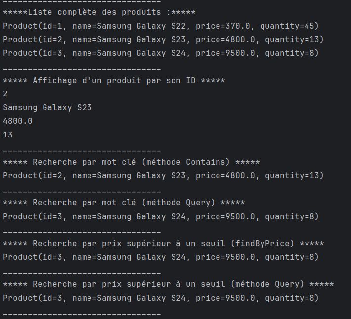
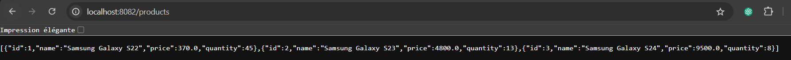
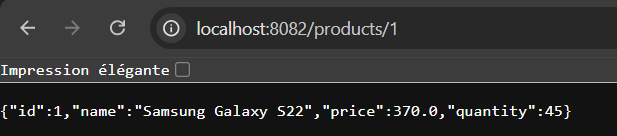

# ORM JPA Hibernate Spring Data

Ce projet illustre l'utilisation de **JPA** (Java Persistence API), **Hibernate** et **Spring Data** pour interagir avec une base de données MySQL. Les fonctionnalités démontrées incluent la persistance des données, les opérations CRUD, et l'exposition d'une API REST pour gérer les produits.

---

## Table des matières

1. [Description du projet](#description-du-projet)
2. [Technologies utilisées](#technologies-utilisées)
3. [Captures d'écran](#captures-décran)
   - [Affichage des produits dans MySQL](#affichage-des-produits-dans-mysql)
   - [Résultats des opérations en console](#résultats-des-opérations-en-console)
   - [Affichage de tous les produits via l'API](#affichage-de-tous-les-produits-via-lapi)
   - [Affichage d'un produit spécifique via l'API](#affichage-dun-produit-spécifique-via-lapi)
4. [Auteur](#auteur)

---

## Description du projet

Ce projet utilise les technologies **ORM** pour connecter une application Java à une base de données MySQL. L'application permet de :
- Créer, lire, mettre à jour et supprimer des produits dans une base de données MySQL.
- Afficher les résultats dans la console.
- Accéder aux données via une API REST.

---

## Technologies utilisées

- **Framework Backend :** Spring Boot
- **ORM :** Hibernate (avec JPA)
- **Base de données :** MySQL
- **API REST :** Spring Data JPA
- **Client MySQL :** phpMyAdmin
- **Langage :** Java

---

## Captures d'écran

### Affichage des produits dans MySQL
Cette capture montre les données persistées dans la base de données MySQL, visualisées via **phpMyAdmin**.

---

### Résultats des opérations en console
Cette capture montre les résultats des différentes opérations CRUD exécutées dans la console.

---

### Affichage de tous les produits via l'API
Cette capture montre la réponse de l'API lorsqu'on effectue une requête pour obtenir tous les produits disponibles.

---

### Affichage d'un produit spécifique via l'API
Cette capture montre la réponse de l'API lorsqu'on effectue une requête pour obtenir un produit spécifique en utilisant son **ID**.

---

## Auteur
Mohamed Amine RIZKI
